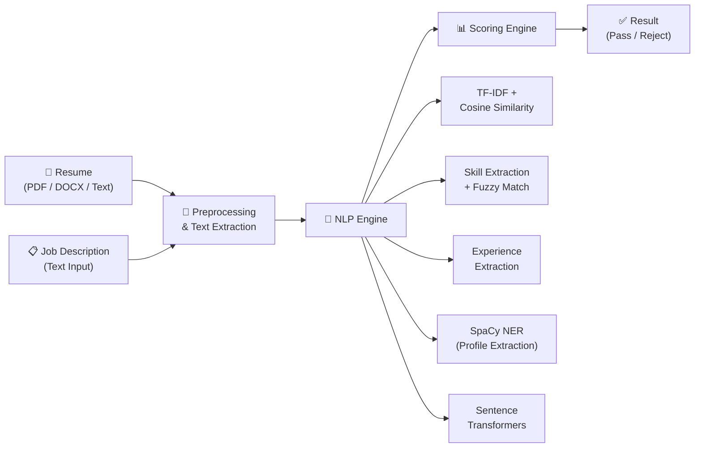

# AI-Powered Resume Screener — Project Details

---

## 1. Abstract

The **AI-Powered Resume Screener** is an intelligent web-based Applicant Tracking System (ATS) that automates the process of evaluating candidate resumes against job descriptions. It leverages **Natural Language Processing (NLP)**, **TF-IDF vectorization**, **semantic embeddings**, and **fuzzy matching** to compute a multi-dimensional compatibility score. The system extracts candidate profiles (name, email, phone, education, links) using SpaCy NER and regex, then scores resumes based on content similarity, skill matching, and experience alignment. It provides actionable suggestions and a pass/reject decision to streamline the hiring pipeline.

---

## 2. System Architecture



---

## 3. Algorithms & Techniques Used

| Algorithm / Technique | Purpose | Library |
|---|---|---|
| **TF-IDF Vectorization** | Converts resume & JD text into numerical vectors based on term importance | `scikit-learn` |
| **Cosine Similarity** | Measures angular similarity between TF-IDF vectors (0–1 scale) | `scikit-learn` |
| **Sentence Transformers** | Deep semantic similarity using `all-MiniLM-L6-v2` pre-trained embeddings | `sentence-transformers` |
| **SpaCy NER** | Named Entity Recognition to extract candidate name, organizations, education | `spacy (en_core_web_sm)` |
| **RapidFuzz** | Fuzzy string matching for skill synonyms (e.g., "JS" ↔ "JavaScript") | `rapidfuzz` |
| **Regex Pattern Matching** | Extract email, phone, experience years, URLs (LinkedIn, GitHub) | `re` (built-in) |

---

## 4. Scoring Formula

The final compatibility score is a **weighted combination** of three components:

```
Final Score = (0.5 × Similarity Score) + (0.3 × Skill Match Score) + (0.2 × Experience Score)
```

| Component | Weight | Description |
|---|---|---|
| **Similarity Score** | 50% | Semantic similarity between resume and JD using Sentence Transformers |
| **Skill Match Score** | 30% | Percentage of JD-required skills found in resume (with fuzzy matching) |
| **Experience Score** | 20% | Ratio of candidate's experience to required experience (capped at 100%) |

> **Decision Rule:** Final Score ≥ 60 → **Passed** | Final Score < 60 → **Rejected**

---

## 5. Technology Stack

| Layer | Technology |
|---|---|
| **Backend** | Python 3.13, Flask 3.1.2 |
| **NLP Models** | SpaCy (`en_core_web_sm`), Sentence Transformers (`all-MiniLM-L6-v2`) |
| **ML Libraries** | scikit-learn (TF-IDF, metrics), RapidFuzz (fuzzy matching) |
| **File Parsing** | pdfplumber (PDF), python-docx (DOCX) |
| **Frontend** | HTML5, CSS3, JavaScript (vanilla) |
| **API** | RESTful JSON API with Flask + Flask-CORS |

---

## 6. Key Features

- **Multi-format Resume Upload** — Supports PDF, DOCX, and plain text input
- **Candidate Profile Extraction** — Auto-detects name, email, phone, education via NLP
- **Link Detection** — Extracts LinkedIn, GitHub, and portfolio URLs from resume
- **Skill Gap Analysis** — Shows matched vs. missing skills with improvement suggestions
- **60+ Skills Database** — Covers programming, cloud, DevOps, data science, soft skills, and more
- **Synonym Recognition** — Maps abbreviations (ML → Machine Learning, JS → JavaScript)
- **Interactive Dashboard** — Visual charts for score breakdown and skill analysis
- **Model Evaluation Module** — Built-in evaluation with 31-sample benchmark dataset

---

## 7. Model Evaluation Results

Evaluated on a **31-sample benchmark dataset** with diverse categories (clear matches, mismatches, partial overlaps, experience gaps, cross-domain candidates):

| Metric | Score |
|---|---|
| **Accuracy** | 90.32% |
| **Precision** | 81.25% |
| **Recall** | 100.00% |
| **F1 Score** | 89.66% |

### Confusion Matrix

|  | Predicted Passed | Predicted Rejected |
|---|---|---|
| **Actual Passed** | 13 (TP) | 0 (FN) |
| **Actual Rejected** | 3 (FP) | 15 (TN) |

> **Key Insight:** The model achieves **100% recall** (never misses a qualified candidate) with **3 false positives** where text similarity overrides skill/experience gaps.

---

## 8. Project Structure

```
resume_screener/
├── app.py                  # Flask backend — routes, NLP, scoring engine
├── evaluate_model.py       # Model evaluation with 31-sample benchmark
├── requirements.txt        # Python dependencies
├── templates/
│   └── index.html          # Main frontend UI
├── static/
│   ├── style.css           # Stylesheet
│   ├── script.js           # Frontend logic & API calls
│   └── graphs.html         # Analytics dashboard
└── README.md               # Project documentation
```

---

## 9. Future Scope

- Increase experience score weight to reduce false positives on experience mismatches
- Add multi-resume batch processing and ranking
- Integrate LLM-based summarization for detailed candidate feedback
- Add database storage for historical analysis and recruiter dashboards
- Deploy on cloud (AWS/Azure) with user authentication

---

> **Tools Used:** Python · Flask · scikit-learn · SpaCy · Sentence Transformers · RapidFuzz · pdfplumber · HTML/CSS/JS
